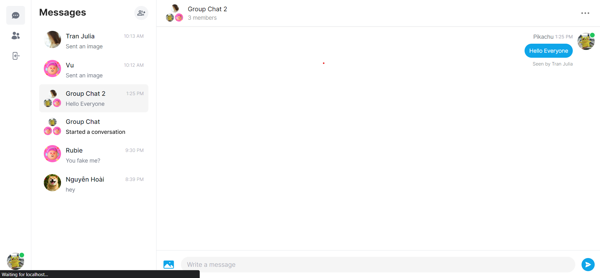
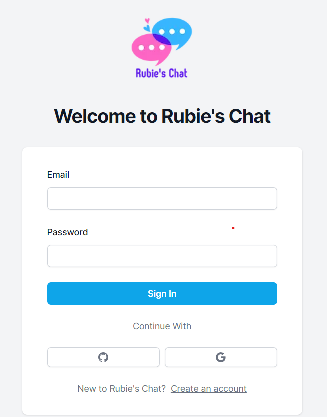
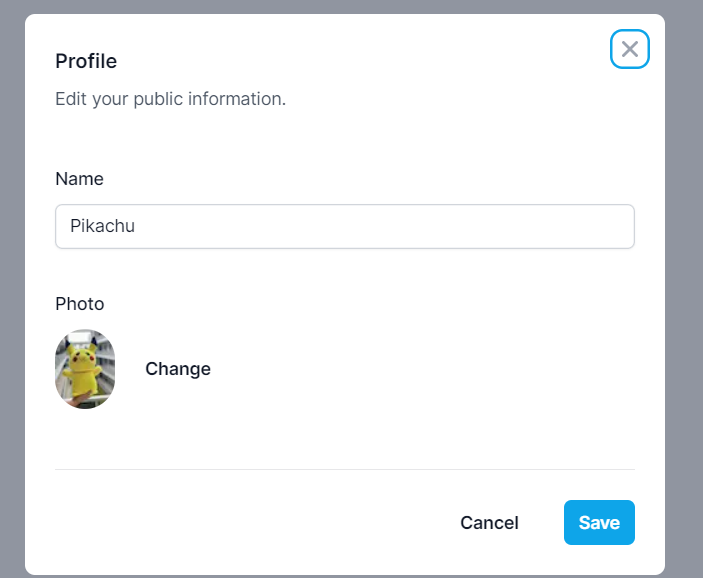

# Rubie's Chat, similar to Messenger

## With features:
- Real-time messaging using Pusher
- Message notifications and alerts
- Tailwind design for sleek UI
- Tailwind animations and transition effects
- Full responsiveness for all devices
- Credential authentication with NextAuth

- Google authentication integration
- Github authentication integration
- File and image upload using Cloudinary CDN
- Client form validation and handling using react-hook-form
- Server error handling with react-toast
- Message read receipts
- Online/offline user status
- Group chats and one-on-one messaging
- Message attachments and file sharing
- User profile customization and settings

- Creating and managing chat rooms and channels